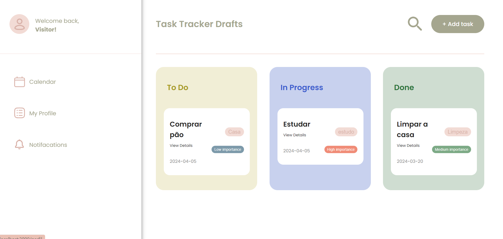

## To-do list
O projeto Task Manager é uma aplicação web desenvolvida para ajudar os usuários a gerenciar suas tarefas de forma eficiente. Com uma interface intuitiva e funcionalidades poderosas, o Task Manager permite que os usuários registrem, visualizem e acompanhem o progresso de suas tarefas de maneira organizada.


<details>

<summary>👇Funcionalidades</summary>

### Registro de Tarefas
Os usuários podem criar novas tarefas, fornecendo informações como nome, data de criação, categoria e nível de importância.

### Visualização e Gerenciamento
As tarefas registradas são exibidas em diferentes colunas, de acordo com seu estado (To Do, In Progress, Done).

Os usuários podem visualizar detalhes de cada tarefa, incluindo seu nome, data de criação e categoria.

As tarefas são classificadas por nível de importância, permitindo uma fácil identificação das prioridades

É possivel editar a tarefa e exclui-la 

</details>


<details>

<summary>👇Tecnologias Utilizadas</summary>

- Node.js: Plataforma de desenvolvimento JavaScript para construção do servidor.
- MySQL: Banco de dados relacional para armazenar e gerenciar as informações das tarefas.
- Handlebars: Sistema de templates para criar interfaces dinâmicas.
- CSS: estilização da interface do usuário.
</details>


## Pré-requisitos

:warning: [Node](https://nodejs.org/en/download/)

:warning: [MySQL](https://nodejs.org/en/download/)


## Executando

### Crie um novo banco Banco de Dados
O projeto utiliza um banco de dados MySQL para armazenar as informações das tarefas, garantindo persistência e segurança dos dados.

```
CREATE DATABASE listatarefas;
USE listatarefas;

CREATE TABLE Tarefas (
id INT AUTO_INCREMENT PRIMARY KEY,
nome VARCHAR(255) NOT NULL,
estado ENUM('feito', 'em_progresso', 'pronto') DEFAULT 'feito',
nivel_importancia ENUM('alto', 'medio', 'baixo') DEFAULT 'medio',
categoria VARCHAR(50),
data_criacao date
);
```

### No terminal coloque 
```
git clone https://github.com/JenniGabriely01/to-do-list.git
cd to-do-list
npm i
npx nodemon index.js
```

## abra a localhost:3000 e aproveite!
